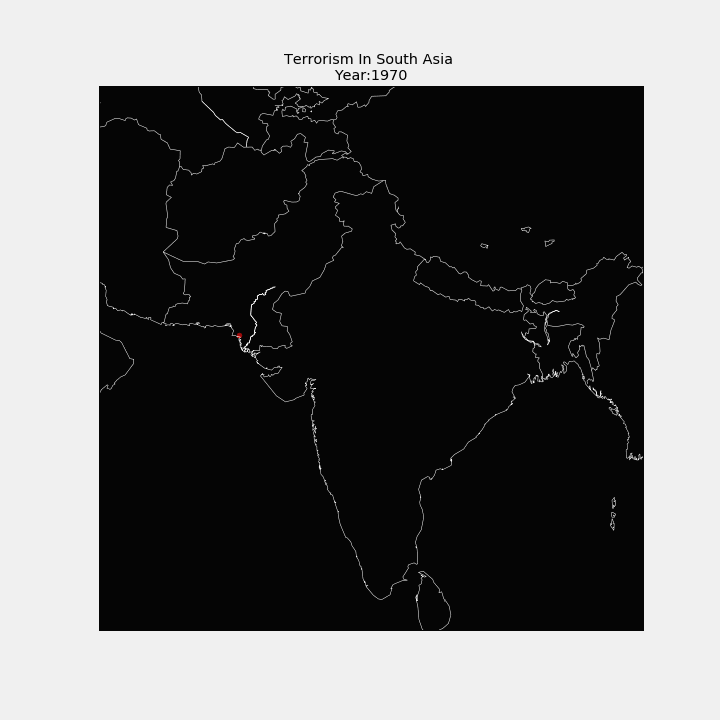

# About the Project 

This is our (Satyam Saini,Kartik Tyagi and Vidushi Tripathi ) [undergraduate thesis](https://drive.google.com/file/d/1NZqP6LaGngcYbHkZE1lsXDX4iW7jj9pJ/view?usp=sharing) for the course - **MajorProjectpart-1(15B19CI791)**.

The work is also an implementation of chapter tiltled ***Ch16: Assessing Impact of Global Terrorism using Time Series Analysis*** in [Advanced Computational Techniques for Sustainable Computing](https://www.routledge.com/Advanced-Computational-Techniques-for-Sustainable-Computing/Rathi-Sinha/p/book/9780367495220
).

# What we did?
* Examined the effects of social,economic and geographic factors on terrorism.

* The indicators for the aforementioned factors were extracted from eight databases:
  * [Global Terrorism Database(GTD)](https://www.start.umd.edu/gtd/)
  * [Ethnic Power Relations(Geo-EPR)](https://icr.ethz.ch/data/epr/geoepr/)
  * [Geographically based Economic data (G-Econ)](https://gecon.yale.edu/)
  * [Population density from NASA’s Earth Observatory](https://neo.gsfc.nasa.gov/view.php?datasetId=SEDAC_POP)
  * [Topography from NASA’s Earth Observatory](https://visibleearth.nasa.gov/images/73934/topography)
  * [DMSP-OLS Nighttime Lights Time Series](https://ngdc.noaa.gov/eog/dmsp/downloadV4composites.html)
  * [World Happiness Index Report](https://www.kaggle.com/unsdsn/world-happiness).

* We then geographically merged these indicators and could predict the possibility of recurring terrorist attack at a location with  an accuracy of **83%**.

* Trained model on features extracted from the selected databases could predict the involvement of **potential organizations for unclaimed past attacks** .

# Deep Diving into the datasets

Below is a timeline of terrorist activites carried into in south Asia from 1970-2017 

